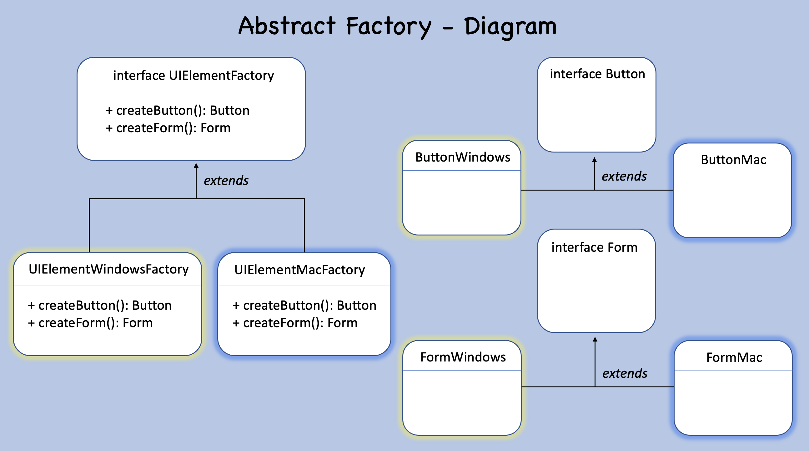

## Abstract Factory

### Purpose

*Provide an interface for creating families of related or dependent objects
without specifying their concrete classes.*

---

### Description

- Is a creation pattern, so it handles object creation.

- Is a factory, as well as factory method and is usually
composed of multiple factory methods.

- Aims to group compatible product families by creating a concrete factory
by group of compatible objects.

- Separates the code that creates from the code that uses the objects (SRP).

- Allows easy implementation of new object families (OCP).

- All programming is focused on interfaces and not on implementations.

---

### When to use

- Use the abstract factory when a system must be independent of how its products are created, composed, or represented.

- Use the abstract factory when a system must be configured with a family of products that may or not work together.

- Use the abstract factory when a family of objects is designed to be used together, 
and you need to enforce this constraint

- Use the abstract factory when you want to provide a product class library,
and you want to reveal only their interfaces, not their implementations.

---

### Pros and Cons

### Pros

- Products will always be compatible with each other.

- Application of the Open/Closed Principle, it's easy to add new factories and products.

- Application of the Single Responsibility Principle,
the code you create is separate from the code that uses the objects.

### Cons

- Many classes and greater complexity will be introduced in the code.
