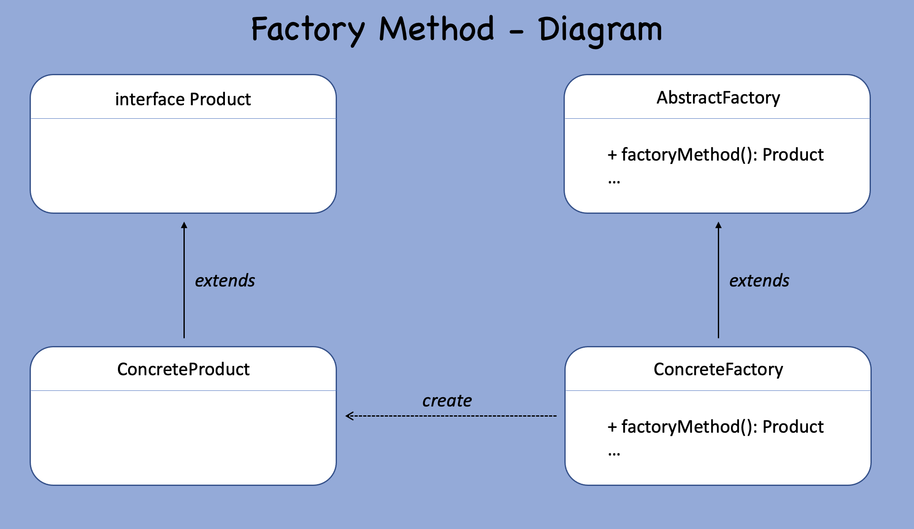

## Factory Method

### Description

- Is a method inside a class (factory)

- Define an interface to create an object,
  but let subclasses decide which class to instantiate.
  The Factory Method allows you to defer instantiation for subclasses.

- Hides the instantiation logic from client code, the factory method
  will be responsible for instantiating the desired classes.

- It is obtained through inheritance.
  Factory method can be created or overridden by subclasses

- Flexibility code allowing the creation of new factories (objects)
  without the need to change the origin factory code

- You can use parameters to determinate the type of the object that you will create based on this parameter,
  or you can receive a parameter on this method and send this parameter to the object that will be created.

---

### When to use

- Use the factory method when you're not sure what types of objects your code will need.

- Use the factory method to allow the extension of your factories to create new objects (Open/Close Principle).

- Use the factory method to separate the code you create from the code that uses the classes/object (Single Responsibility Principle).

- Use the factory method to hook subclasses to let them decide object creation logic.

- Use the factory method to eliminate duplicated code when creating objects.

---

### Pros and Cons

### Pros

- Apply Open/Close Principle, your code will be open to extension and close to changes.

- Apply Single Responsibility Principle, that means, separate the code that create the object from the code thar use the object.

### Cons

- Can cause a massive usage of subclasses - you need one factory for each object (1:1).
